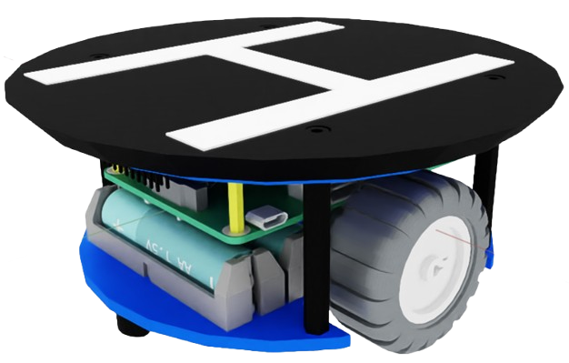

# AlphaBot2 Drone Landing Platform

[![ubuntu22][ubuntu22-badge]][ubuntu22]
[![humble][humble-badge]][humble]
![ignition-gazebo][ignition-gazebo-badge]


<div style="display: flex; align-items: center; gap: 10px;">
  
  <span style="font-size: 32px; font-weight: bold;">+</span>
  
</div>

A set of ROS2 packages for modeling and simulating the [Waveshare Alphabot2](https://www.waveshare.com/product/robotics/mobile-robots/raspberry-pi-robots/alphabot2-pi3-b-plus.htm) robot, modified to carry a drone landing platform.<br>
The targeted drone is the [Bitcraze Crazyflie](https://www.bitcraze.io/crazyflie/), a small open-source drone.

Clone the repository into `<your_ros2_workspace>/src`, then
```shell
$> cd <your_ros2_workspace>
$> colcon build --packages-select ab2_description
$> colcon build --packages-select ab2_gazebo
```
This is a work in progress, more packages to come in the future.

[humble]: https://docs.ros.org/en/humble/index.html
[humble-badge]: https://img.shields.io/badge/-HUMBLE-orange?style=flat-square&logo=ros
[ubuntu22-badge]: https://img.shields.io/badge/-UBUNTU%2022%2E04-blue?style=flat-square&logo=ubuntu&logoColor=white
[ubuntu22]: https://releases.ubuntu.com/jammy/
[ignition-gazebo-badge]:https://img.shields.io/badge/Ignition-Fortress_v6.16.0-blue
