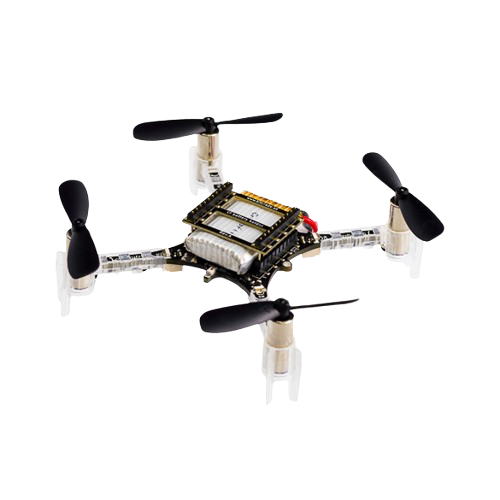
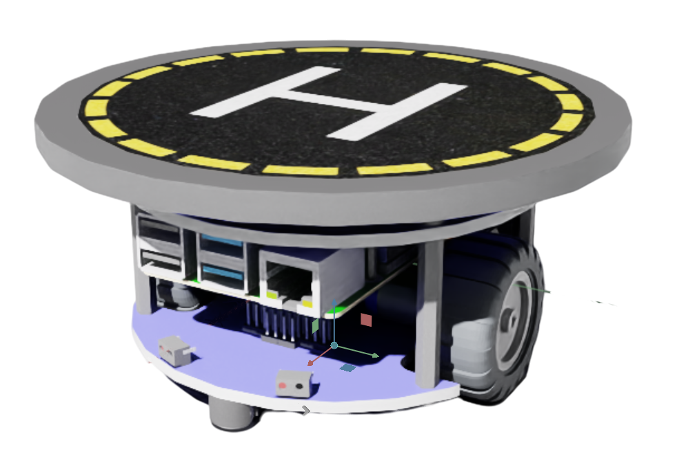

# AlphaBot2 Drone Landing Platform

[![ubuntu22][ubuntu22-badge]][ubuntu22]
[![humble][humble-badge]][humble]
![ignition-gazebo][ignition-gazebo-badge]


<p align="left">
  
  
</p>

A collection of **ROS2 packages** designed to simulate and control the [Waveshare Alphabot2](https://www.waveshare.com/product/robotics/mobile-robots/raspberry-pi-robots/alphabot2-pi3-b-plus.htm) robot, modified to include a **drone landing platform**.  
The intended drone is the [Bitcraze Crazyflie](https://www.bitcraze.io/crazyflie/), an **open-source nano drone**.

# Host configuration


## ROS2 Humble installation (instructions from [here](https://docs.ros.org/en/rolling/index.html))
```shell
$> sudo apt install software-properties-common build-essential
$> sudo add-apt-repository universe
$> sudo apt update
$> export ROS_APT_SOURCE_VERSION=$(curl -s https://api.github.com/repos/ros-infrastructure/ros-apt-source/releases/latest | grep -F "tag_name" | awk -F\" '{print $4}')
$> curl -L -o /tmp/ros2-apt-source.deb https://github.com/ros-infrastructure/ros-apt-source/releases/download/${ROS_APT_SOURCE_VERSION}/ros2-apt-source ${ROS_APT_SOURCE_VERSION}.$(. /ryc/os-release && echo $VERSION_CODENAME)_all.deb
$> sudo dpkg -i /tmp/ros2-apt-source.deb
$> sudo apt update
$> sudo apt upgrade

$> sudo apt install ros-humble-ros-base ros-humble-rmw-cyclonedds-cpp
$> echo "source /opt/ros/humble/setup.bash" >> ~/.bashrc
$> echo "export ROS_DOMAIN_ID=0" >> ~/.bashrc
$> echo "export RMW_IMPLEMENTATION=rmw_cyclonedds_cpp" >> ~/.bashrc
$> source ~/.bashrc
```

## Gazebo Harmonic (AMD64 architecture only)
Install via [these instructions](https://gazebosim.org/docs/harmonic/install_ubuntu/). This is not the recommended Gazebo for humble but we will install the specific ROS bridge for this later. Then,
```shell
$> sudo apt-get install ros-humble-ros-gzharmonic
```
In another terminal, use the keyboard to control the platform:
```shell
$> ros2 run teleop_twist_keyboard teleop_twist_keyboard 
```

## ROS2 Humble packages installation
Clone the repository into `<your_ros2_workspace>/src`, then:
```shell
$> cd <your_ros2_workspace>
$> colcon build --packages-select ab2_description
$> colcon build --packages-select ab2_gazebo
$> source install/setup.bash
```

## Execution
```shell
$> ros2 launch ab2_gazebo empty_world.launch.py
```


# Platform configuration (Alphabot2)
Flash SD card with Ubuntu 22.04 server 64 bits with wireless configured and ssh service enabled. One can name the platform `alphabot<ros_domain_id>`.

```shell
$> sudo apt update
$> sudo apt upgrade
$> sudo reboot now
``` 

## Preventing long boot time
```shell
$> sudo systemctl mask systemd-networkd-wait-online.service
```
## Deactivate auto-upgrades
```shell
$> sudo nano /etc/apt/apt.conf.d/20auto-upgrades
```
Change content to:
```shell
APT::Periodic::Update-Package-Lists "0";
APT::Periodic::Unattended-Upgrade "0";
```
## Disable suspend and hibernation
```shell
$> sudo systemctl mask sleep.target suspend.target hibernate.target hybrid-sleep.target
```

## Setup BTBerryWifi
**BTBerryWifi** enables you to configure the Wi-Fi network on a Raspberry Pi via **Bluetooth** using your smartphone or tablet.  
This is especially useful when the device needs to connect to a new local network with updated Wi-Fi credentials (see [GitHub project](https://github.com/nksan/Rpi-SetWiFi-viaBluetooth)).  
The companion mobile application is available on [Apple App Store](https://apps.apple.com/fr/app/btberrywifi/id1596978011) and [Google Play Store](https://play.google.com/store/apps/details?id=com.bluepieapps.btberrywifi&hl=fr&pli=1)

```shell
$> curl  -L https://raw.githubusercontent.com/nksan/Rpi-SetWiFi-viaBluetooth/main/btwifisetInstall.sh | bash
```

## Allow btwifiset service to restart on error
```shell
$> sudo nano /etc/systemd/system/btwifiset.service
```
Then, add the following content:
```shell
[Unit]
Description=btwifiset
...
StartLimitIntervalSec=500
StartLimitBurst=5
...
[Service]
...
Restart=on-failure
RestartSec=5s
...
```

## ROS2 Humble installation
Same instructions as above.  
⚠️ Ensure that the same value is assigned to the environment variable `ROS_DOMAIN_ID`.


## ROS2 Alphabot2 Control packages 
follow the instructions here: https://github.com/Mik3Rizzo/alphabot2-ros2/tree/main 
No camera is attached to the Alphabot2 platform, before compiling the package modify <ros_workpackage>/src/alphabot2-ros2/alphabot2/launch/alphabot2_launch.py to remove the following lines:
```
...
#launch_description.add_action(v4l2_camera_node)
#launch_description.add_action(qr_detector_node)
...
```
Then, run
```
$> ros2 run teleop_twist_keyboard teleop_twist_keyboard --ros-args -r /cmd_vel:=/alphabot2/cmd_vel
```
Hit 'u', 'i', 'o', etc to control the platform.

# Automatic package startup at boot
Create the file `/home/alphabot<ros_domain_id>/start_platform.sh`
```                                                            
#!/bin/bash
source /opt/ros/humble/setup.bash
source /home/alphabot0/ros2_ws/install/setup.bash
ros2 launch alphabot2 alphabot2_launch.py
```
Then,
```
$> chmod 777 /home/alphabot<ros_domain_id>/start_platform.sh
```
Create the service `/etc/systemd/system/platform.service` :
```
[Unit]
Description=Alphabot2 Platform ROS2 Launch
After=network.target

[Service]
Type=simple
User=alphabot<ros_domain_id>
ExecStart=/home/alphabot<ros_domain_id>/start_platform.sh
Restart=on-failure
Environment="DISPLAY=:0"

[Install]
WantedBy=multi-user.target
```
Activate the service:
```
sudo systemctl daemon-reload
sudo systemctl enable platform.service
sudo systemctl start platform.service
```


[humble]: https://docs.ros.org/en/humble/index.html
[humble-badge]: https://img.shields.io/badge/-HUMBLE-orange?style=flat-square&logo=ros
[ubuntu22-badge]: https://img.shields.io/badge/-UBUNTU%2022%2E04-blue?style=flat-square&logo=ubuntu&logoColor=white
[ubuntu22]: https://releases.ubuntu.com/jammy/
[ignition-gazebo-badge]:https://img.shields.io/badge/Ignition-Fortress_v6.16.0-blue
