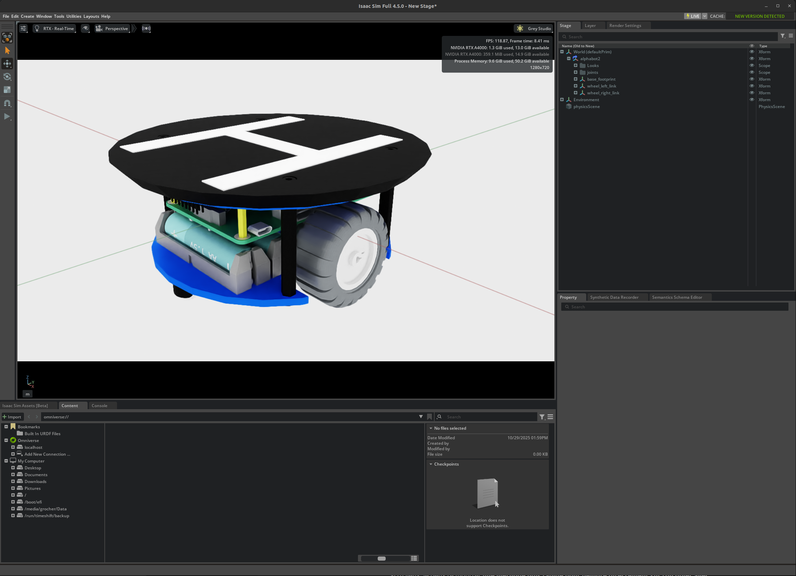

# AlphaBot2 Description

[![humble][humble-badge]][humble]
[![ubuntu22][ubuntu22-badge]][ubuntu22]

This is the description of the Waveshare Alphabot2 robot modified to carry a drone landing platform.
Clone the repository into `<your_ros2_workspace>/src`, then
```shell
$> cd <your_ros2_workspace>
$> colcon build --packages-select ab2_description
$> ros2 launch ab2_description robot.launch.py
```
The launch file starts publishing the description on the topic `/robot_description`. The joint state publisher node is started as well.
Robot can be visualized in RViz2 from another terminal:
```shell
$> rviz2 &
```


[humble]: https://docs.ros.org/en/humble/index.html
[humble-badge]: https://img.shields.io/badge/-HUMBLE-orange?style=flat-square&logo=ros
[ubuntu22-badge]: https://img.shields.io/badge/-UBUNTU%2022%2E04-blue?style=flat-square&logo=ubuntu&logoColor=white
[ubuntu22]: https://releases.ubuntu.com/jammy/

An Universal Scene Description (USD) model is also provided to be used with NVidia [IsaacLab](https://github.com/isaac-sim/IsaacLab) and [IsaacSim](https://github.com/isaac-sim/IsaacSim).

