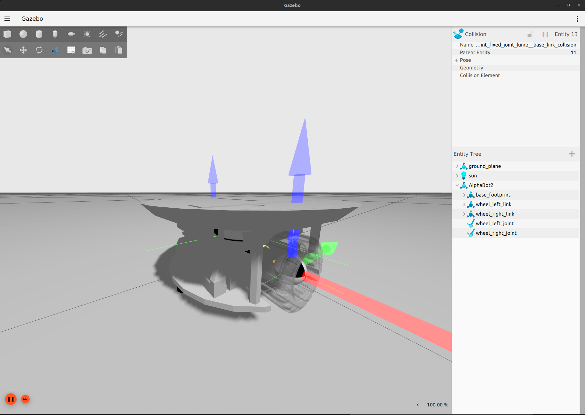
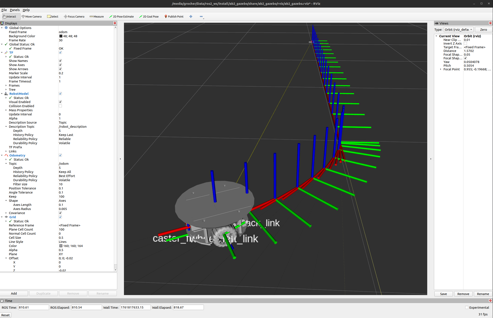

# AlphaBot2 Drone Landing Platform Gazebo Simulation

[![ubuntu22][ubuntu22-badge]][ubuntu22]
[![humble][humble-badge]][humble]
![ignition-gazebo][ignition-gazebo-badge]

A ROS2 package for simulating the Waveshare Alphabot2 robot in Gazebo Ignition Fortress.

Clone the repository into `<your_ros2_workspace>/src`, then
```shell
$> cd <your_ros2_workspace>
$> colcon build --packages-select ab2_gazebo
$> ros2 launch ab2_gazebo empty_world.launch.py
```
The launch file starts the simulation and RViz2. One can control the robot using, in another terminal:
```shell
$> ros2 run teleop_twist_keyboard teleop_twist_keyboard
```



[humble]: https://docs.ros.org/en/humble/index.html
[humble-badge]: https://img.shields.io/badge/-HUMBLE-orange?style=flat-square&logo=ros
[ubuntu22-badge]: https://img.shields.io/badge/-UBUNTU%2022%2E04-blue?style=flat-square&logo=ubuntu&logoColor=white
[ubuntu22]: https://releases.ubuntu.com/jammy/
[ignition-gazebo-badge]:https://img.shields.io/badge/Ignition-Fortress_v6.16.0-blue
